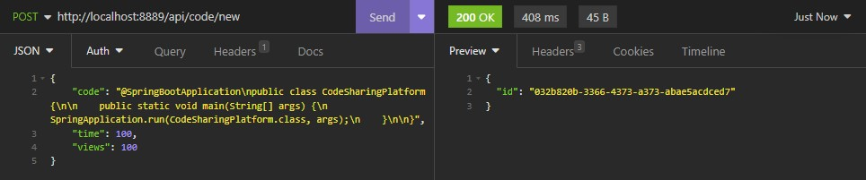
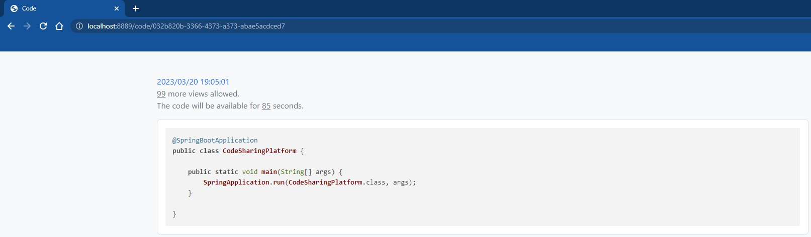
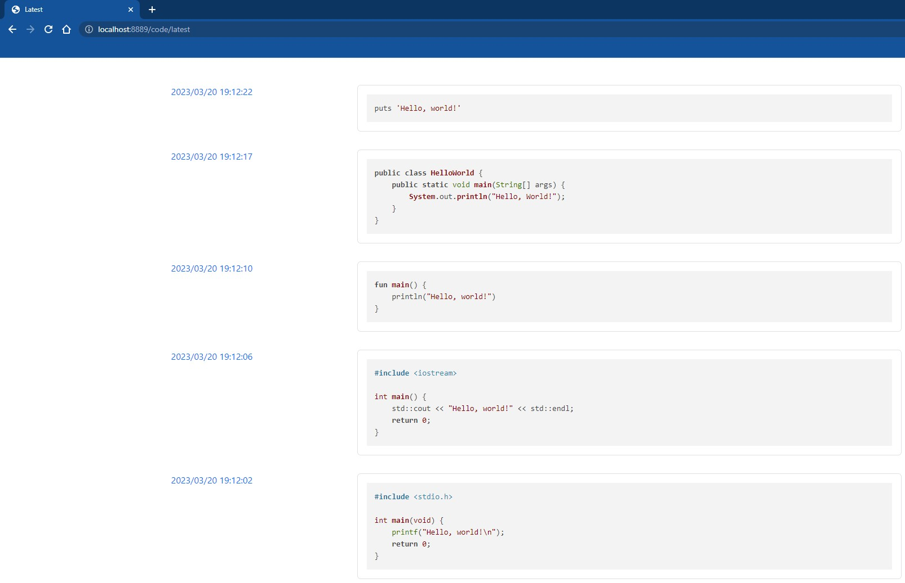

## code-sharing-platform

[](https://github.com/douglasdotv/code-sharing-platform/blob/master/README.md)
[](https://github.com/douglasdotv/code-sharing-platform/blob/master/README.pt-br.md)

### About
This is a web application that allows users to share code snippets with each other.

**Example 1:**



**Example 2:**


The user can write code, set an expiration date and/or a maximum number of views for it, and then share the code snippet link with others.

Both time and views restrictions are optional.
If they are set, the snippet will be private and available until a restriction is reached (it is deleted from the database after that).
On the other hand, if none of them are set, the snippet will be public and available forever.
(Negative or null values and the number 0 for the `time` and `views` fields are interpreted as an absence of a restriction. Positive values are interpreted as a restriction.)

Available endpoints:

* `GET /code/new` - Create a new code snippet page
* `POST /api/code/new` - Save a new code snippet
* `GET /code/{id}` - Access a code snippet page
* `GET /api/code/{id}` - Get a code snippet in JSON format
* `GET /code/latest` - Access the latest public code snippets (code snippets without time or views restriction)
* `GET /api/code/latest` - Get the latest public code snippets (code snippets without time or views restriction) in JSON format

### Project stages
<details open="open">
  <summary>Stages</summary>
  <ol>
  <li><a href="https://hyperskill.org/projects/130/stages/692/implement">Show the code!</a></li>
  <li><a href="https://hyperskill.org/projects/130/stages/693/implement">POST updates</a></li>
  <li><a href="https://hyperskill.org/projects/130/stages/694/implement">Snippets feed</a></li>
  <li><a href="https://hyperskill.org/projects/130/stages/695/implement">Work with the database</a></li>
  <li><a href="https://hyperskill.org/projects/130/stages/696/implement">Super secret snippets</a></li>
  </ol>
</details>

### Technologies used
* Java 17
* Gradle
* Spring Boot 2.5.6
* Spring MVC
* Spring Data JPA
* H2 Database
* Thymeleaf
* highlight.js
* Bootstrap

### Skills developed throughout the project
* How to use Spring Boot and Spring MVC to create a web application
* How to use Spring Data JPA and H2 to work with a database
* How to use Thymeleaf to create a web page
* How to use highlight.js to highlight code snippets
* How to use Bootstrap to style a web page

### How to run the project
1. Make sure that you have JDK (Java Development Kit) and JRE (Java Runtime Environment) installed on your computer and that you're connected to the Internet.

2. Open a terminal and clone the repository:
```
git clone https://github.com/douglasdotv/code-sharing-platform.git
```

3. Navigate to the project folder:
```
cd code-sharing-platform
```

4. Build and run the application
```
./gradlew build
./gradlew bootRun
```

5. Access the application endpoints using a browser or a client like Postman or Insomnia.
   (The application will run on port 8889 by default. Example: http://localhost:8889/code/new.)

### Contact
If you have any questions or suggestions, feel free to contact me via [LinkedIn](https://www.linkedin.com/in/douglasdotv/) or via email (douglas16722@gmail.com).